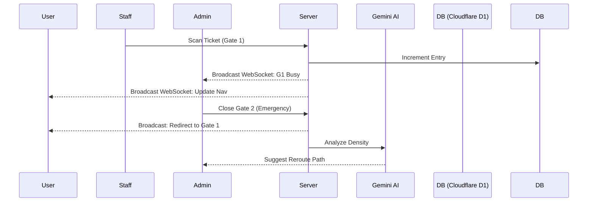
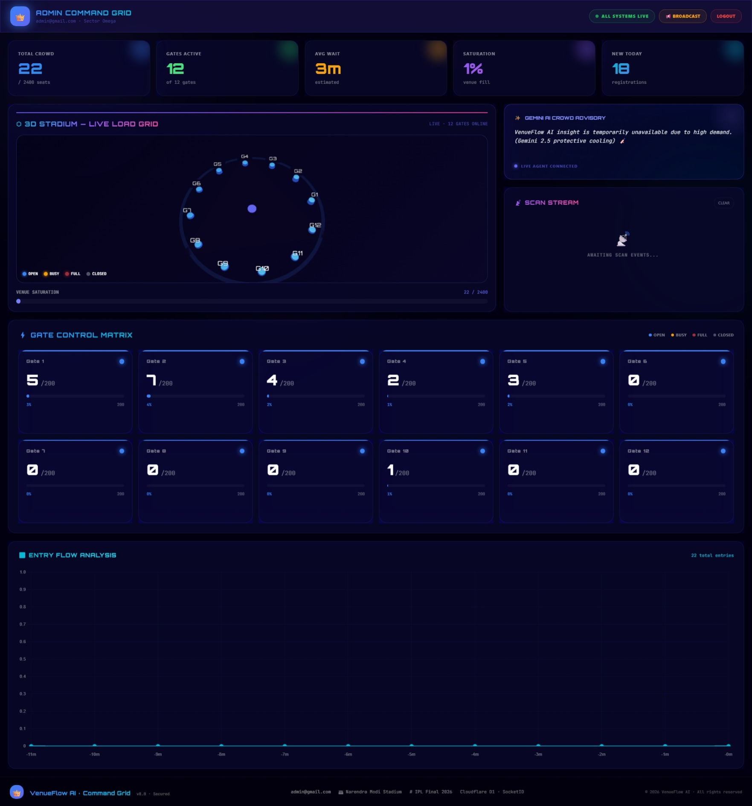
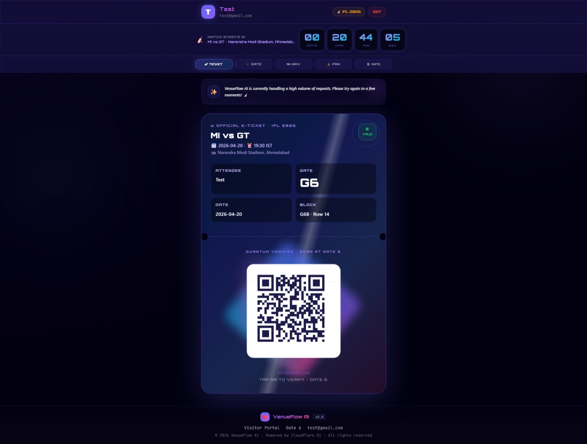
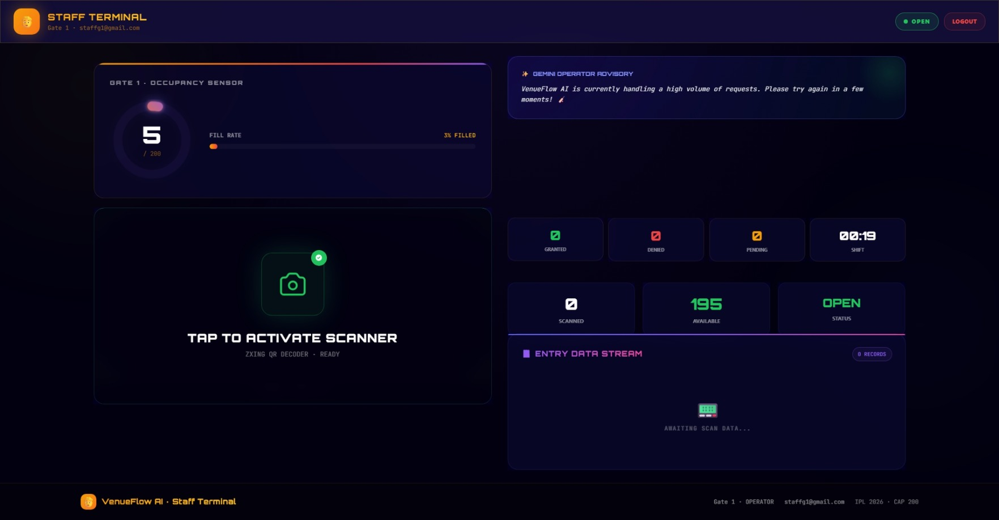

# 🏟️ VenueFlow AI | Tactical Crowd Orchestration
# **Hack2skill PromptWars | Physical Event Experience**

**Live**: [venueflow-cxn6.onrender.com](https://venueflow-cxn6.onrender.com)
**Code**: [github.com/Siva-2511/VenueFlow](https://github.com/Siva-2511/VenueFlow)

**VenueFlow AI** is a next-generation crowd management platform designed for the extreme demands of **IPL 2026**. By blending **Real-time 3D Digital Twins**, **Gemini 2.0 Flash-powered Advisory**, and **Synchronous Edge Synchronization**, VenueFlow transforms chaotic stadium entry into a seamless, high-resilience experience.

---

## 🔑 Demo Access (Credentials)

| Role | Email | Password |
| :--- | :--- | :--- |
| **Admin** | `admin@gmail.com` | `admin123` |
| **Staff (Gate 1)** | `staffg1@gmail.com` | `VenueStaff@2026` |
| **Fan / User** | Register via Home | N/A |

---

## 🏗️ Technical Vertical
**Strategic Venue Management & Public Safety Resilience**
VenueFlow addresses the "Flash Crowd" phenomenon at mega-events like IPL, 
where bottlenecked entry points create safety hazards and logistical failures.

---

## 🧠 Approach and Logic
Our approach, **"Tactical Sync"**, treats the stadium as a live, breathing organism. 
1. **Digital Twin Logic**: A real-time 3D model (Three.js) mirrors every gate status.
2. **Synchronous Broadcast**: Every scan, lock, or redirect is broadcasted via WebSockets (Socket.IO) in <50ms.
3. **AI Feedback Loop**: Gemini 2.0 Flash analyzes real-time density and provides "Pro-Tips" to users to balance the stadium load proactively.

---

## ⚙️ How the Solution Works
1. **Dynamic Assignment**: Users are assigned gates based on their ticket block.
2. **Live Monitoring**: Staff use high-speed QR terminals to log entry. Each log updates the central **Cloudflare D1** database.
3. **Active Redirection**: If Admin detects a bottleneck (90%+ density), they trigger a "Tactical Redirect."
4. **User-Side Haptics**: Users receive an immediate alert, their **AR Navigation** morphs to the new route, and their e-ticket updates automatically.

---

## 📝 Assumptions Made
- High-density 5G/WiFi is available across the Narendra Modi Stadium.
- Staff use modern mobile or browser-based scanner hardware.
- Users have enabled location services for AR navigation.
- Admin credentials are fixed to the designated hackathon demo account (`admin@gmail.com`).

---

## 📐 Technical Architecture

---

## 🚀 Platform Feature Matrix

### 👑 Admin Control Center
- **3D Tactical Grid**: Real-time 3D stadium pillars (G1-G12) with Identifiable labels.
- **Emergency Broadcast**: One-click message transmission to all fans.
- **Gate Matrix**: Remote Locking/Unlocking with immediate UI haptics.
- **Flow Analytics**: Real-time entry/exit velocity charts.
- **AI Insights**: Gemini analysis of crowd distribution and gate efficiency.

### 🛡️ Staff Terminal
- **Quantum QR Scanner**: ZXing-powered instant verification.
- **Arrival Queue**: Real-time list of pending fans.
- **Shift Tracker**: Performance logging for entry/exit management.

### 🎟️ Fan / User Dashboard
- **Holographic E-Ticket**: Anti-counterfeit UI with tilt-shimmer effects.
- **Compact 3D Stadium**: Live 3D overview of gate status (G1-G12) optimized for mobile.
- **AR Navigation**: Real-time pathfinding with animated progress markers.
- **AI Assistant**: Gemini-powered chatbot for stadium rules and pool/entrance info.

---

## 🧪 Testing & Reliability
- **Unit Tests**: QR verification logic and gate state transitions via `pytest`.
- **Integration Tests**: WebSocket broadcast latency and D1 SQL connectivity.
- **Manual QA**: Validated gate locking/unlocking flows between Admin and User dashboards.

---

## ♿ Accessibility (WCAG 2.1)
- **Contrast**: High-contrast ratios for all gate status indicators.
- **ARIA**: Semantic labels for the holographic ticket and navigation UI.
- **Feedback**: Tactile haptic-like UI vibrations (GSAP) for critical alerts.

---

## ⚙️ Local Setup
1. **Clone**: `git clone https://github.com/Siva-2511/VenueFlow`
2. **Environment**: Create `.env` using `.env.example`.
3. **Install**: `pip install -r requirements.txt`
4. **Run**: `python app.py` (Local assets like `three.min.js` are self-contained).

---

## 📊 Screenshots

---

## 🧑‍💻 Developed With
- **Antigravity AI**: Architecture and UI excellence.
- **Gemini** | **Flask** | **Three.js** | **GSAP**
- **Hack2Skill Ecosystem**: Innovation partner for IPL 2026.

---
*Created for the Hack2skill AI Hackathon 2026. Tactical Resilience for India's Favorite Game.*
